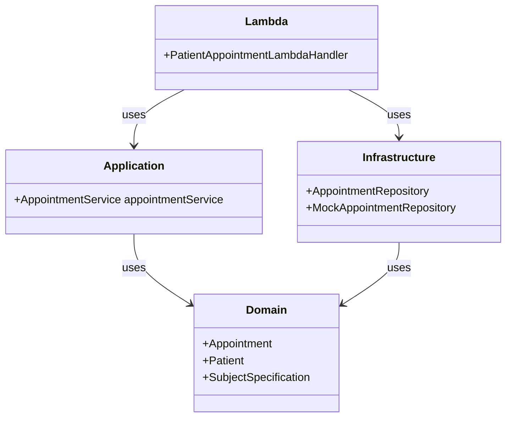

# Patients Appointments API

This project is a simple REST API application for retrieving patient appointments. The application is built using AWS SAM (Serverless Application Model) and TypeScript.

## Application Directory Structure

The source code for the application resides in the `src` directory:
```

.
├── README.md # Project documentation
├── samconfig.toml # AWS SAM CLI configuration file
├── src
│ ├── application # Contains application services
│ ├── command # Contains AWS Lambda handlers
│ ├── domain # Contains the domain model and logic
│ ├── infrastructure # Contains infrastructure classes that connect to external services
│ └── tests # Contains unit tests
└── template.yaml # AWS SAM template defining AWS resources
```

## Prerequisites

Before you begin, ensure you have the following software installed on your system:

-   Node.js
-   Docker
-   AWS SAM CLI

## Setup Instructions

To set up the project and install dependencies, navigate to the project directory and run:

```bash
npm install
```

## Run Tests

To run the tests using npm, execute the following command:

```bash
npm test
```

## Running SAM Locally

To run the SAM application locally, you need to have the AWS SAM CLI installed. If you haven't installed it yet, follow the official installation guide.

Once you have the SAM CLI installed, navigate to the project's root directory and execute the following command:

```bash
sam build
sam local start-api
```

## Invoking APIs for Each User

To invoke the APIs for each user, use the following endpoints:

User1: http://127.0.0.1:3000/patients/user1/appointments

User2: http://127.0.0.1:3000/patients/user2/appointments

## Deploy to the Cloud

To build and deploy your application to AWS, run the following in your shell:

```bash
sam build
sam deploy --guided
```

Below is the software architecture diagram of the application:



To visualize this diagram, you can use a Mermaid live editor or integrate it into any Markdown viewer that supports Mermaid diagrams.

### Tools & Techniques

#### 1. **Domain-Driven Design (DDD)**
   - **Description**: DDD is an approach to software development that emphasizes collaboration between technical and domain experts to iteratively refine a conceptual model that addresses complex domain logic.
   - **Link**: [Domain-Driven Design: Microservices Patterns](https://learn.microsoft.com/en-us/dotnet/architecture/microservices/microservice-ddd-cqrs-patterns/ddd-oriented-microservice)

#### 2. **TypeScript**
   - **Description**: TypeScript is a statically typed superset of JavaScript that compiles to plain JavaScript, allowing for better tooling and error-checking.
   - **Link**: [TypeScript Official Documentation](https://www.typescriptlang.org/)

#### 3. **AWS Serverless Application Model (SAM)**
   - **Description**: AWS SAM is a framework for building serverless applications. It provides a simplified way of defining and deploying AWS Lambda functions, API Gateway, DynamoDB, and more.
   - **Links**:
     - [AWS SAM Official Documentation](https://docs.aws.amazon.com/serverless-application-model/latest/developerguide/what-is-sam.html)
     - [Mastering the AWS Serverless Application Model (AWS SAM) - AWS Online Tech Talks](https://www.youtube.com/watch?v=QBBewrKR1qg)
     - [SAM Policy Templates](https://docs.aws.amazon.com/serverless-application-model/latest/developerguide/serverless-policy-templates.html)
     - [AWS SAM Patterns](https://serverlessland.com/patterns?framework=SAM)

#### 4. **Jest**
   - **Description**: Jest is a delightful JavaScript testing framework with a focus on simplicity. It works out of the box for most JavaScript projects.
   - **Link**: [Jest Official Documentation](https://jestjs.io/)

#### 5. **ESLint**
   - **Description**: ESLint is a static code analysis tool for identifying and fixing problems in JavaScript code, with support for TypeScript.
   - **Link**: [ESLint Official Documentation](https://eslint.org/)

#### 6. **Prettier**
   - **Description**: Prettier is an opinionated code formatter that enforces a consistent style by parsing code and reprinting it with its own rules.
   - **Link**: [Prettier Official Documentation](https://prettier.io/)

#### 7. **ts-arch**
   - **Description**: ts-arch is a library for checking architecture conventions in TypeScript and JavaScript projects, allowing you to enforce architecture rules.
   - **Link**: [ts-arch GitHub Repository](https://github.com/ts-arch/ts-arch)


### Additional Resources

- **Node.js**: JavaScript runtime built on Chrome's V8 JavaScript engine.
  - [Node.js Official Documentation](https://nodejs.org/en/docs/)

- **Docker**: A platform for developing, shipping, and running applications in containers.
  - [Docker Official Documentation](https://docs.docker.com/)
