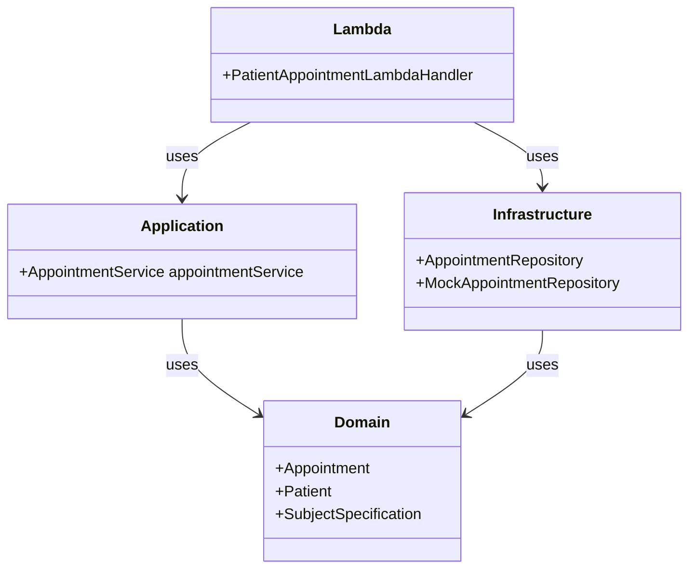

# Patients Appointments API

This project is a simple REST API application for retrieving patient appointments. The application is built using AWS SAM (Serverless Application Model) and TypeScript.

## Application Directory Structure

The source code for the application resides in the `src` directory:

.
├── README.md # Project documentation
├── samconfig.toml # AWS SAM CLI configuration file
├── src
│ ├── application # Contains application services
│ ├── command # Contains AWS Lambda handlers
│ ├── domain # Contains the domain model and logic
│ ├── infrastructure # Contains infrastructure classes that connect to external services
│ └── tests # Contains unit tests
└── template.yaml # AWS SAM template defining AWS resources


## Prerequisites

Before you begin, ensure you have the following software installed on your system:

- Node.js
- Docker
- AWS SAM CLI

## Setup Instructions

To set up the project and install dependencies, navigate to the project directory and run:

```bash
npm install
```

## Run Tests
To run the tests using npm, execute the following command:

```bash
npm test
```
## Running SAM Locally
To run the SAM application locally, you need to have the AWS SAM CLI installed. If you haven't installed it yet, follow the official installation guide.

Once you have the SAM CLI installed, navigate to the project's root directory and execute the following command:

```bash
sam build
sam local start-api
```

## Invoking APIs for Each User
To invoke the APIs for each user, use the following endpoints:

User1: http://127.0.0.1:3000/patients/user1/appointments
User2: http://127.0.0.1:3000/patients/user2/appointments

## Deploy to the Cloud
To build and deploy your application to AWS, run the following in your shell:

```bash
sam build
sam deploy --guided
```

Below is the software architecture diagram of the application:


To visualize this diagram, you can use a Mermaid live editor or integrate it into any Markdown viewer that supports Mermaid diagrams.

