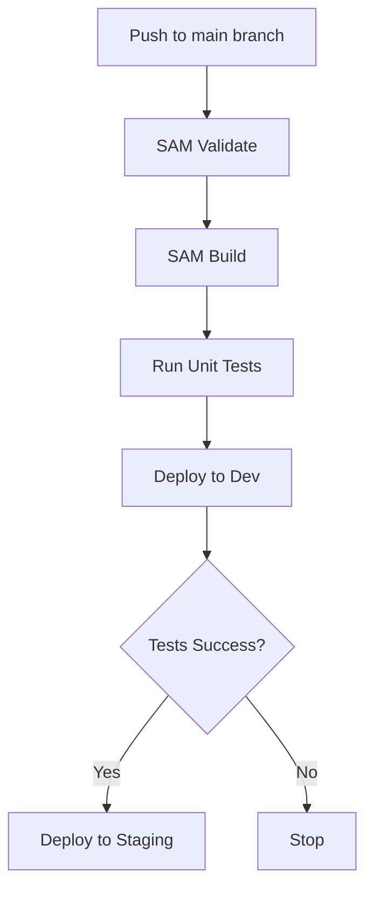
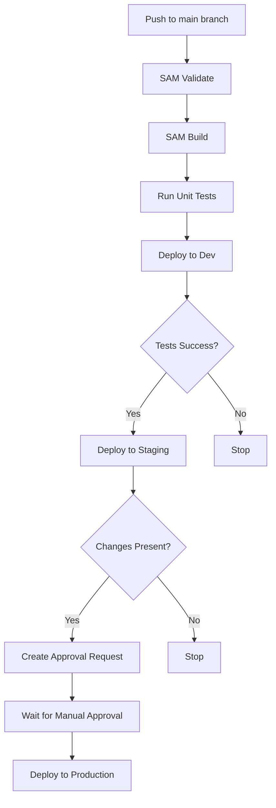

# Patients Appointments API

This project is a simple REST API application for retrieving patient appointments. The application is built using AWS SAM (Serverless Application Model) and TypeScript.

## Index

1. [Application Directory Structure](#application-directory-structure)
2. [Prerequisites](#prerequisites)
3. [Setup Instructions](#setup-instructions)
4. [Run Tests](#run-tests)
5. [Running SAM Locally](#running-sam-locally)
6. [Invoking APIs for Each User](#invoking-apis-for-each-user)
7. [Deploy to the Cloud](#deploy-to-the-cloud)
8. [Software Architecture Diagram](#software-architecture-diagram)
9. [Tools & Techniques](#tools--techniques)
   1. [Domain-Driven Design (DDD)](#1-domain-driven-design-ddd)
   2. [AWS Serverless Application Model (SAM)](#3-aws-serverless-application-model-sam)
   3. [ts-arch](#7-ts-arch)
10. [Deployment Approaches](#deployment-approaches)
    1. [Continuous Deployment to Dev and Staging](#1-continuous-deployment-to-dev-and-staging)
    2. [Manual Deployment to Production](#2-manual-deployment-to-production)


## Application Directory Structure

The source code for the application resides in the `src` directory:
```

.
├── README.md # Project documentation
├── samconfig.toml # AWS SAM CLI configuration file
├── src
│ ├── application # Contains application services
│ ├── command # Contains AWS Lambda handlers
│ ├── domain # Contains the domain model and logic
│ ├── infrastructure # Contains infrastructure classes that connect to external services
│ └── tests # Contains unit tests
└── template.yaml # AWS SAM template defining AWS resources
```

## Prerequisites

Before you begin, ensure you have the following software installed on your system:

-   Node.js
-   Docker
-   AWS SAM CLI

## Setup Instructions

To set up the project and install dependencies, navigate to the project directory and run:

```bash
npm install
```

## Run Tests

To run the tests using npm, execute the following command:

```bash
npm test
```

## Running SAM Locally

To run the SAM application locally, you need to have the AWS SAM CLI installed. If you haven't installed it yet, follow the official installation guide.

Once you have the SAM CLI installed, navigate to the project's root directory and execute the following command:

```bash
sam build
sam local start-api
```

## Invoking APIs for Each User

To invoke the APIs for each user, use the following endpoints:

User1: http://127.0.0.1:3000/patients/user1/appointments

User2: http://127.0.0.1:3000/patients/user2/appointments

## Deploy to the Cloud

To build and deploy your application to AWS, run the following in your shell:

```bash
sam build
sam deploy --guided
```

Below is the software architecture diagram of the application:


To visualize this diagram, you can use a Mermaid live editor or integrate it into any Markdown viewer that supports Mermaid diagrams.

### Tools & Techniques

#### 1. **Domain-Driven Design (DDD)**
   - **Description**: Domain-Driven Design (DDD) emphasizes creating a domain model based on the reality of business use cases. It involves defining independent problem areas as Bounded Contexts, which align with microservices. DDD promotes the use of a ubiquitous language to describe problems and suggests technical concepts like domain entities, value objects, and aggregates.

    A key aspect of DDD is the separation of layers within a microservice. This separation helps manage complexity by clearly defining responsibilities and ensuring that each layer focuses on specific concerns
   - **Link**: [Domain-Driven Design: Microservices Patterns](https://learn.microsoft.com/en-us/dotnet/architecture/microservices/microservice-ddd-cqrs-patterns/ddd-oriented-microservice)


#### 3. **AWS Serverless Application Model (SAM)**
   - **Description**: AWS SAM is a framework for building serverless applications. It provides a simplified way of defining and deploying AWS Lambda functions, API Gateway, DynamoDB, and more.
   - **Links**:
     - [AWS SAM Official Documentation](https://docs.aws.amazon.com/serverless-application-model/latest/developerguide/what-is-sam.html)
     - [Mastering the AWS Serverless Application Model (AWS SAM) - AWS Online Tech Talks](https://www.youtube.com/watch?v=QBBewrKR1qg)
     - [SAM Policy Templates](https://docs.aws.amazon.com/serverless-application-model/latest/developerguide/serverless-policy-templates.html)
     - [AWS SAM Patterns](https://serverlessland.com/patterns?framework=SAM)

#### 7. **ts-arch**
   - **Description**: ts-arch is a library for checking architecture conventions in TypeScript and JavaScript projects, allowing you to enforce architecture rules.
   - **Link**: [ts-arch GitHub Repository](https://github.com/ts-arch/ts-arch)

## Deployment Approaches
Our project utilizes two different deployment approaches to manage the release process across development (dev), staging, and production environments. Here is an overview of these approaches, along with diagrams to illustrate the workflows.

### 1. Continuous Deployment to Dev and Staging
This approach automatically deploys changes to the dev environment after a merge to the main branch. If the deployment and tests succeed, it subsequently deploys to the staging environment. This ensures that all changes are validated in a controlled manner before any manual intervention is required.


#### Workflow Steps:

- Triggered by a push to the main branch.
- Validates the SAM template.
- Builds the SAM application.
- Runs unit tests.
- Deploys to the dev environment.
- Deploys to the staging environment if the dev deployment succeeds.



Another workflow is triggered to push changes to production.

### 2. Manual Deployment to Production
This approach includes a manual approval step before deploying to the production environment. After successful deployment to the staging environment, a manual approval request is created. Once approved, the changes are deployed to the production environment.

#### Workflow Steps:

- Triggered by a push to the main branch.
- Deploys to dev and staging environments as described above.
- Creates an approval request if there are changes to deploy.
- Waits for manual approval.
- Deploys to the production environment upon approval.


