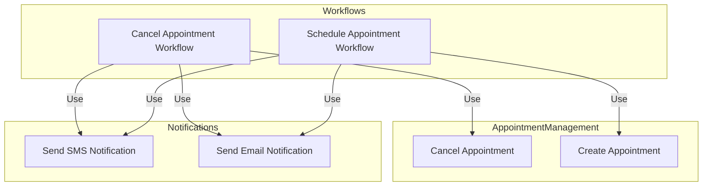

# Patients Appointments Temporal IO Project

This repository hosts the Temporal workflows used in the orchestration of services and activities related to the Patients Appointments API. It is set up as a shared monorepo to allow full flexibility in reusing activities across workflows.

## Code Organization

```plaintext
patients-appointments-temporal/
├── activities
│   ├── appointment-management
│   └── notification
├── domain
│   ├── patients
│   └── appointments
├── pkg
│   ├── bootstrap
│   └── infrastructure
└── workflows
    ├── patients
    └── appointments
```
- **activities**: Reusable activities designed to be employed in various workflows.
- **domain**: Reusable domain objects that are utilized in multiple activities. These are organized by specific domains or capabilities.
- **pkg**: Utilities and libraries that are shared across the project, such as our logging system.
- **workflows**: These are organized by domain/capability and correspond to Temporal namespaces. Each domain is a distinct namespace. This is where workflow implementations and worker definitions are housed.


## Building and Running the Project

### Prerequisites
Make sure to initialize the correct Node.js/npm version. An .nvmrc file has been provided, and nvm use will ensure that you are set up correctly.

### Initial Setup
Simply run:

```bash
npm install
```
### Running the Project
1. Start Temporal Server:

```bash
temporal server start-dev
```
2. Start the Worker:

```bash
npm run start.watch
```
3. Run the Workflow Client:

In another shell, run:

```bash
npm run workflow
```
The Workflow should return:

```bash
Hello, Temporal!
```

## Workflow and Activity Diagram
This section illustrates the relationship between various activities and workflows in our appointment management system. The diagram below showcases how different activities are utilized within specific workflows, emphasizing their reusability and domain organization.


### Explanation
#### Appointment Management Domain:

- **Cancel Appointment**: Handles the logic for canceling an appointment.
- **Create Appointment**: Handles the logic for creating a new appointment.
#### Notifications Domain:

- **Send SMS Notification**: Sends an SMS notification to a patient.
- **Send Email Notification**: Sends an email notification to a patient.
#### Workflows:

##### Cancel Appointment Workflow:

- Uses the Cancel Appointment activity to cancel the appointment.
- Uses the Send SMS Notification activity to notify the patient via SMS.
- Uses the Send Email Notification activity to notify the patient via email.
##### Schedule Appointment Workflow:

- Uses the Create Appointment activity to schedule a new appointment.
- Uses the Send SMS Notification activity to notify the patient via SMS.
- Uses the Send Email Notification activity to notify the patient via email.


